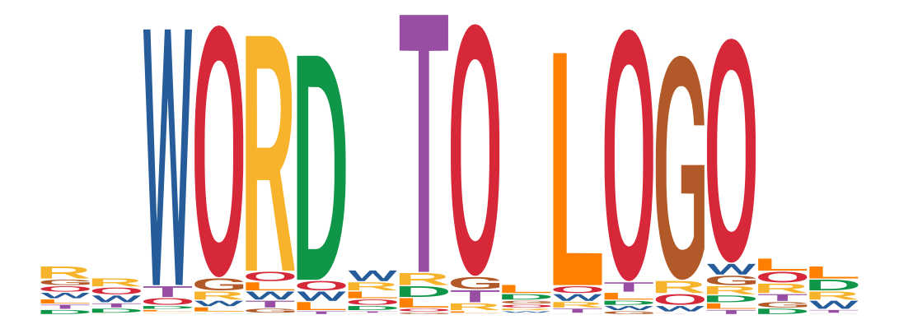

# WORDtoLOGO #

  

This is a Shiny App that takes a word or multiple words (best to use a couple, so it looks nice) and generates a sequence logo-like figure with that word(s).

**Try it out:** [https://ievarau.shinyapps.io/WORDtoLOGO/](https://ievarau.shinyapps.io/WORDtoLOGO/)

## How it works? ##

In the script within the app, the input word(s) are read and converted to upper case character. A matrix of dimensions $(n+4)*m$, where $n$ is a lenght of the input word(s) and $m$ is a number of unique input characters, is created and filled with random small numbers. Then depending on the position of the specific character (letter), the small number is substituted with a random large number to emphasize them in the final logo.

### Acknowledgments ###

I once created just my name as a logo in a quite manual way. The idea to create a Shiny app to convert any word in an automatic manner was given by [Jaime A Castro-Mondragón](https://jaimicore.github.io/).

### Contact info ###

:scroll: **Personal website:** [ievarau.github.io](https://ievarau.github.io/)

:bird: **Twitter:** [@IevaRau](https://twitter.com/ievarau)

:mailbox: **E-mail:** ievarau@uio.no